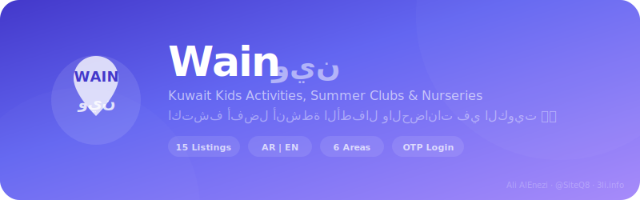
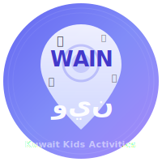

<div align="center">



<br/><br/>



### 📍 Wain | وين

**Kuwait Kids Activities, Summer Clubs, Nurseries & Babysitters**

[]()
[]()
[]()
[]()

**"وين تبي تروح؟"** — Help parents in Kuwait discover, compare, and book the best activities for their kids.

[**Live Demo**](https://siteq8.github.io/Wain) · [**Firestore Schema**](firebase/firestore-schema.md) · [**Flutter Models**](flutter-app/lib/models/)

</div>

---

## 📱 Live Demo

**[siteq8.github.io/Wain](https://siteq8.github.io/Wain)** — Enter any phone → Send OTP → Any 4 digits → Explore!

---

## ✨ Features

### User App
- **OTP Login** — Phone + 4-digit code + quick demo login
- **Home** — "وين تبي تروح?" search, featured slider, categories, recommendations
- **Search** — Filter by area, type, age, rating, transport. 15 listings
- **Detail** — Gallery, prices, facilities, reviews, WhatsApp/Call, Book Now
- **Booking** — Package selection, dates, coupon codes, status tracking
- **Favorites** — Save and manage favorite listings
- **Profile** — Kids management, booking history, AR/EN toggle, logout
- **Bilingual** — Full Arabic (RTL) and English (LTR) with one-tap switch

### Admin Dashboard
- **Roles** — Super Admin, Sub-Admin, Nursery Owner
- **Listings** — CRUD, photos, pricing, availability, featured toggle
- **Bookings** — View all, approve/reject, status management
- **Users** — View parents, block/verify
- **Reviews** — Approve or hide, respond
- **Coupons** — Create codes, discount %, validity
- **Analytics** — Bookings, revenue, popular areas, top-rated

### Payments
- MyFatoorah / Tap Payments integration
- KNET national debit
- Cash on arrival (admin toggle)

---

## 🏢 15 Demo Listings

| # | Name | Type | Area | Age | Price | Rating |
|---|------|------|------|-----|-------|--------|
| 1 | 🏊 Fun Summer Club | Camp | Salmiya | 4-12 | 120 KD/mo | 4.8 |
| 2 | 👶 Al Noor Nursery | Nursery | Hawalli | 0.5-4 | 180 KD/mo | 4.9 |
| 3 | 🏊 Swimming Academy | Activity | S. Salem | 3-16 | 45 KD/8s | 4.7 |
| 4 | ⛺ Adventure Camp | Camp | Farwaniya | 6-14 | 95 KD/mo | 4.6 |
| 5 | 🎒 Future Buds | Nursery | Capital | 1-4 | 200 KD/mo | 4.5 |
| 6 | 👩‍👧 Um Sarah | Sitter | Hawalli | 0-10 | 3 KD/hr | 4.9 |
| 7 | 🤖 Robotics Center | Activity | Salmiya | 7-16 | 60 KD/co | 4.8 |
| 8 | 🎨 Art Studio | Activity | Jahra | 4-14 | 35 KD/mo | 4.4 |
| 9 | ⚽ Sports Camp | Camp | Capital | 5-15 | 85 KD/mo | 4.7 |
| 10 | 👸 Princesses Nursery | Nursery | S. Salem | 1-5 | 220 KD/mo | 4.8 |
| 11 | 👨‍🍳 Cooking Club | Activity | Salmiya | 5-14 | 30 KD/4s | 4.6 |
| 12 | 👩‍👧‍👦 Nanny Maria | Sitter | Farwaniya | 0-8 | 3.5 KD/hr | 4.7 |
| 13 | ⚽ Football Academy | Activity | Farwaniya | 4-16 | 50 KD/mo | 4.9 |
| 14 | 🎭 Creators Camp | Camp | Hawalli | 4-12 | 75 KD/mo | 4.5 |
| 15 | 🐥 Little Bird Nursery | Nursery | Jahra | 0.5-3 | 100 KD/mo | 4.3 |

---

## 🔥 Firestore Schema

8 collections: `users` · `kids` · `listings` · `bookings` · `reviews` · `coupons` · `notifications` · `admins`

Each listing: type, name_ar/en, area, geo, prices, age range, photos, rating, facilities, transport, featured, whatsapp, phone

See full schema: [`firebase/firestore-schema.md`](firebase/firestore-schema.md)

---

## 📂 Project Structure

```
Wain/
├── docs/                    ← Live Demo (GitHub Pages)
│   ├── index.html           ← Full app (46KB, 15 listings)
│   ├── logo.svg             ← Creative Wain logo
│   └── banner.svg           ← README banner
├── flutter-app/lib/
│   ├── models/              ← Dart data models
│   ├── screens/             ← App screens
│   ├── services/            ← Firebase services
│   └── widgets/             ← Reusable components
├── admin-dashboard/src/     ← React admin panel
├── firebase/
│   ├── firestore-schema.md  ← Full DB schema
│   └── firestore-rules/     ← Security rules
└── README.md
```

---

## 🚀 Quick Start

```bash
# Demo (instant)
open https://siteq8.github.io/Wain

# Flutter
cd flutter-app && flutter pub get && flutter run

# Admin
cd admin-dashboard && npm install && npm run dev

# Firebase
firebase init firestore
```

---

## 🎨 Design System

| Element | Value |
|---------|-------|
| Primary | `#6366f1` Indigo |
| Cards | 16px radius, soft shadows |
| Fonts | Inter (EN) + Tajawal (AR) |
| Style | Pastel gradients, emoji icons |
| Direction | RTL (AR) / LTR (EN) |

---

## 👤 Author

<div align="center">

**Ali AlEnezi** · [@SiteQ8](https://github.com/SiteQ8) · [3li.info](https://3li.info)

📧 Site@hotmail.com · 🇰🇼 Kuwait

</div>
